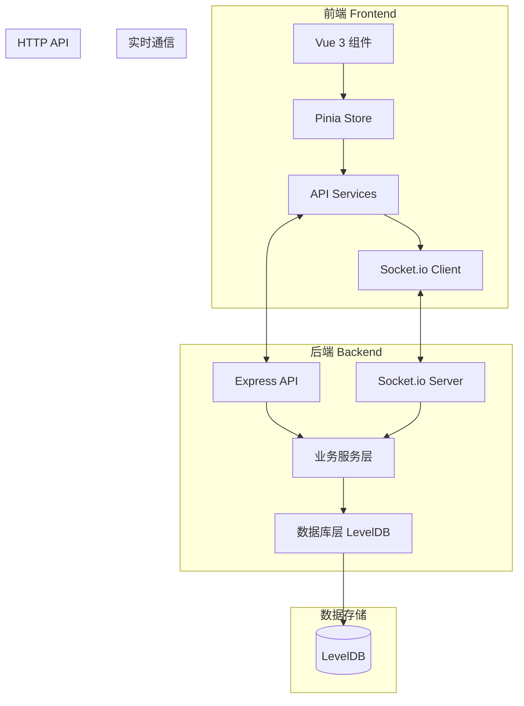

# 🌌 星河之怒 (Galaxy Wrath)

~~以下内容为AI总结，部分存在扯淡情况，象征性看看得了~~

<div align="center">


**一款基于程序化生成的2D宇宙策略网页游戏**

[🎮 游戏特色](#-游戏特色) • [🚀 快速开始](#-快速开始) • [📖 技术文档](#-技术文档) • [🏗️ 项目架构](#️-项目架构)

</div>

---

## 🎮 游戏特色

### 🌟 核心玩法
- **无限宇宙探索**: 基于柏林噪声的程序化生成，每个玩家看到相同的宇宙
- **行星占领与建设**: 7种行星类型，4种区划系统，战略性建筑布局
- **资源生产链**: 三级资源体系，从基础矿物到高级科技组件
- **实时多人在线**: Socket.io实现毫秒级同步，支持离线收益

### 🎨 视觉体验
- **冷色调科幻风格**: 深蓝主色调，避免刺眼光效
- **60FPS流畅渲染**: Pixi.js + pixi-viewport实现高性能2D渲染(由于屎山,并非高性能)
- **动态星空背景**: Canvas粒子系统，鼠标视差效果
- **响应式设计**: 适配不同屏幕尺寸

### ⚡ 技术亮点
- **程序化生成**: 基于种子的确定性宇宙，保证游戏一致性
- **性能优化**: 视口范围动态加载，远距离自动清理
- **实时同步**: WebSocket推送资源变化和建筑状态
- **离线收益**: 智能计算离线期间的25%资源产出

---

## 🚀 快速开始

### 📋 环境要求
- **Node.js**: 18.x 或更高版本
- **pnpm**: 推荐包管理器
- **现代浏览器**: 支持Canvas和WebSocket

### 🔧 安装与运行

```bash
# 克隆项目
git clone <repository-url>
cd galaxy_wrath

# 安装依赖
pnpm install

# 启动后端服务 (端口: 3000)
pnpm dev_run_backend

# 启动前端服务 (端口: 5173)
pnpm dev_run_frontend
```

### 🌐 访问游戏
- **前端地址**: http://localhost:5173
- **后端API**: http://localhost:3000
- **测试账号**: 任意邮箱 + 6位数字验证码

---

## 📖 技术文档

### 🏗️ 技术栈

#### 前端技术栈
| 技术 | 版本 | 用途 |
|------|------|------|
| **Vue 3** | 3.5.x | 渐进式框架 |
| **TypeScript** | 5.x | 类型安全 |
| **Vite** | 7.x | 构建工具 |
| **Pixi.js** | 8.x | 2D渲染引擎 |
| **Pinia** | 3.x | 状态管理 |
| **Socket.io** | 4.x | 实时通信 |

#### 后端技术栈
| 技术 | 版本 | 用途 |
|------|------|------|
| **Node.js** | 18.x | 运行环境 |
| **Express** | 5.x | Web框架 |
| **LevelDB** | 10.x | 键值数据库 |
| **Socket.io** | 4.x | WebSocket服务 |
| **JWT** | 9.x | 用户认证 |
| **bcrypt** | 6.x | 密码加密 |

### 🎯 核心系统

#### 1. 宇宙生成系统
- **柏林噪声算法**: 决定星系分布密度
- **坐标系统**: ESWN四方向无限延伸
- **星系结构**: 9×9=81个行星位置
- **动态加载**: 视口范围内实时渲染

#### 2. 行星系统
- **7种行星类型**: 高山、沼泽、冰冻、熔岩、干旱、热带、寒带
- **4种区划**: 采矿、发电、农业、荒芜
- **大小系统**: 4-7随机，影响区划数量
- **占领机制**: 初始分配+扩张占领

#### 3. 建筑系统
- **9种建筑类型**: 从基础生产到高级功能建筑
- **相邻加成**: 同类建筑相邻+2.5%产能
- **建造时间**: 5-60秒，根据建筑等级
- **升级系统**: 提升产能，解锁新功能

#### 4. 资源生产系统
- **三级资源链**: 矿物→合金→科技组件
- **生产周期**: 1秒/次全局计算
- **离线收益**: 25%在线收益率，最大24小时
- **实时同步**: WebSocket推送资源变化

---

## 🏗️ 项目架构

### 📁 目录结构

```
galaxy_wrath/
├── 📦 package/                    # 主项目目录
│   ├── 🎨 frontend/               # 前端项目
│   │   ├── src/
│   │   │   ├── 🖼️ views/         # 页面视图
│   │   │   │   ├── Login.vue              # 登录页
│   │   │   │   ├── Register.vue           # 注册页
│   │   │   │   ├── ResetPassword.vue      # 找回密码
│   │   │   │   ├── Universe.vue           # 宇宙主界面
│   │   │   │   └── Planet.vue             # 行星详情
│   │   │   ├── 🧩 components/    # 可复用组件
│   │   │   │   ├── StarBackground.vue     # 星空背景
│   │   │   │   ├── UniverseCanvas.vue     # 宇宙画布
│   │   │   │   ├── PlanetGrid.vue         # 行星网格
│   │   │   │   └── BuildingPanel.vue      # 建筑面板
│   │   │   ├── 🗃️ stores/        # Pinia状态管理
│   │   │   │   ├── user.ts               # 用户状态
│   │   │   │   ├── universe.ts           # 宇宙状态
│   │   │   │   ├── planet.ts             # 行星状态
│   │   │   │   └── resources.ts          # 资源状态
│   │   │   ├── 🌐 services/      # API服务
│   │   │   │   ├── auth.ts               # 认证服务
│   │   │   │   ├── planet.ts             # 行星服务
│   │   │   │   └── socket.ts             # Socket服务
│   │   │   ├── 🛠️ utils/         # 工具函数
│   │   │   │   ├── galaxyGenerator.ts    # 星系生成
│   │   │   │   ├── planetGenerator.ts    # 行星生成
│   │   │   │   └── noiseGenerator.ts     # 噪声生成
│   │   │   ├── 📝 types/         # 类型定义
│   │   │   │   ├── user.ts
│   │   │   │   ├── galaxy.ts
│   │   │   │   ├── planet.ts
│   │   │   │   ├── building.ts
│   │   │   │   └── resource.ts
│   │   │   ├── 🛣️ router/        # 路由配置
│   │   │   │   └── index.ts
│   │   │   ├── App.vue
│   │   │   └── main.ts
│   │   └── 📄 package.json
│   └── ⚙️ backend/               # 后端项目
│       ├── src/
│       │   ├── 🗄️ database/      # 数据库操作
│       │   │   ├── db.ts                 # LevelDB初始化
│       │   │   ├── userDB.ts             # 用户数据
│       │   │   ├── planetDB.ts           # 行星数据
│       │   │   └── buildingDB.ts          # 建筑数据
│       │   ├── 🔧 services/      # 业务逻辑
│       │   │   ├── authService.ts        # 认证服务
│       │   │   ├── universeService.ts    # 宇宙服务
│       │   │   ├── productionService.ts  # 生产服务
│       │   │   └── SocketEventsHandler.ts # Socket处理
│       │   ├── 🛠️ utils/         # 工具函数
│       │   │   ├── encryption.ts         # 加密工具
│       │   │   └── jwt.ts                # JWT工具
│       │   ├── 📝 types/         # 类型定义
│       │   │   └── index.ts
│       │   ├── ⚙️ config/        # 配置文件
│       │   │   └── constants.ts          # 游戏常量
│       │   └── index.ts          # 入口文件
│       └── 📄 package.json
├── 📄 package.json               # 根项目配置
└── 📄 README.md                  # 项目文档
```

### 🔄 数据流架构



---

## 🎮 游戏机制详解

### 🌌 宇宙探索
- **无限星图**: 基于柏林噪声的程序化生成
- **星系命名**: `[方向][距离]` 格式，如 `N1E1`, `S2W3`
- **行星ID**: `[星系ID]_[位置]` 格式，如 `N1E1_11`
- **动态加载**: 视口范围内实时渲染，远距离自动清理

### 🪐 行星系统
| 行星类型 | 矿物 | 电力 | 食物 | 特色 |
|----------|------|------|------|------|
| 高山 (Mountain) | ⭐⭐⭐ | ⭐⭐ | ⭐ | 高矿物产出 |
| 沼泽 (Swamp) | ⭐⭐ | ⭐⭐ | ⭐⭐ | 平衡资源 |
| 冰冻 (Frozen) | ⭐⭐ | ⭐ | ⭐⭐ | 低温环境 |
| 熔岩 (Lava) | ⭐⭐⭐ | ⭐ | ⭐ | 极端环境 |
| 干旱 (Arid) | ⭐⭐ | ⭐⭐ | ⭐ | 低农业 |
| 热带 (Tropical) | ⭐ | ⭐⭐ | ⭐⭐⭐ | 高农业 |
| 寒带 (Tundra) | ⭐⭐ | ⭐⭐ | ⭐ | 中等资源 |

### 🏭 建筑系统
#### 一级生产建筑
- **采矿钻井**: 矿物产出
- **发电园区**: 电力产出  
- **水培农场**: 食物产出

#### 二级生产建筑
- **矿物精炼机**: 矿物 → 合金
- **电压变频设备**: 电力 → 高能电池
- **食品加工厂**: 食物 → 消费品

#### 功能建筑
- **居民楼**: 提供人口，增加效率
- **星系要塞**: 防御建筑
- **殖民船坞**: 生产殖民船

### 💎 资源系统
#### 资源分级
- **一级资源**: 矿物、电力、食物
- **二级资源**: 合金、高能电池、消费品
- **三级资源**: 科技组件、殖民船

#### 生产计算
```
最终产能 = 基础产能 × (1 + 相邻加成) × (1 + 科技加成) × (1 - 行星惩罚)
```

---

## 📊 开发状态

### ✅ 已完成功能 (100%)

| 模块 | 状态 | 完成度 | 说明 |
|------|------|--------|------|
| 🔐 用户系统 | ✅ 完成 | 100% | 注册/登录/找回密码/JWT认证 |
| 🌌 宇宙系统 | ✅ 完成 | 100% | 无限星图/柏林噪声/动态加载 |
| 🪐 行星系统 | ✅ 完成 | 100% | 7种类型/4种区划/网格界面 |
| 🏭 建筑系统 | ✅ 完成 | 100% | 9种建筑/建造升级/相邻加成 |
| ⚡ 生产系统 | ✅ 完成 | 100% | 每秒计算/三级资源链 |
| 🔄 实时同步 | ✅ 完成 | 100% | Socket推送/自动保存 |
| 💰 离线收益 | ✅ 完成 | 100% | 25%收益率/最大24小时 |
| 🎨 UI界面 | ✅ 完成 | 100% | 冷色调科幻风格/响应式 |

---

## 🔧 开发指南

### 🛠️ 开发环境设置
```bash
# 安装依赖
pnpm install

# 启动开发服务器
pnpm dev_run_backend  # 后端 (端口: 3000)
pnpm dev_run_frontend # 前端 (端口: 5173)
```

### 📝 代码规范
- **TypeScript**: 严格模式，完整类型定义
- **ESLint + Prettier**: 统一代码风格
- **组件设计**: 单一职责原则
- **UI设计**: 冷色调科幻风格

### 🧪 测试说明
- **测试账号**: 任意邮箱 + 6位数字验证码
- **测试数据**: 自动生成初始行星和资源
- **离线测试**: 支持离线收益计算

---

## 🚀 部署指南

### 📦 生产构建
```bash
# 构建前端
pnpm build:frontend

# 构建产物位于 package/frontend/dist/
```

### 🌐 服务器部署
```bash
# 后端部署
cd package/backend
pnpm install --production
pnpm start

# 前端部署
# 将 dist/ 目录部署到静态文件服务器
```

### ⚙️ 环境配置
```env
# 后端环境变量
PORT=3000
JWT_SECRET=your-secret-key
DB_PATH=./data/galaxy_wrath_db
```

---

## 🔮 未来规划

### 🎯 短期目标
- [ ] 科技树系统
- [ ] PVP战斗系统
- [ ] 联盟/公会系统

### 🌟 长期愿景
- [ ] 排行榜系统
- [ ] 成就系统
- [ ] 移动端适配
- [ ] 多语言支持

---

## 📄 许可证

本项目采用 MIT 许可证 - 查看 [LICENSE](LICENSE) 文件了解详情

---

## 🤝 贡献指南

欢迎贡献代码！请遵循以下步骤：

1. Fork 本项目
2. 创建功能分支 (`git checkout -b feature/AmazingFeature`)
3. 提交更改 (`git commit -m 'Add some AmazingFeature'`)
4. 推送到分支 (`git push origin feature/AmazingFeature`)
5. 开启 Pull Request

---

<div align="center">

**🌟 如果这个项目对你有帮助，请给个 Star！**

</div>